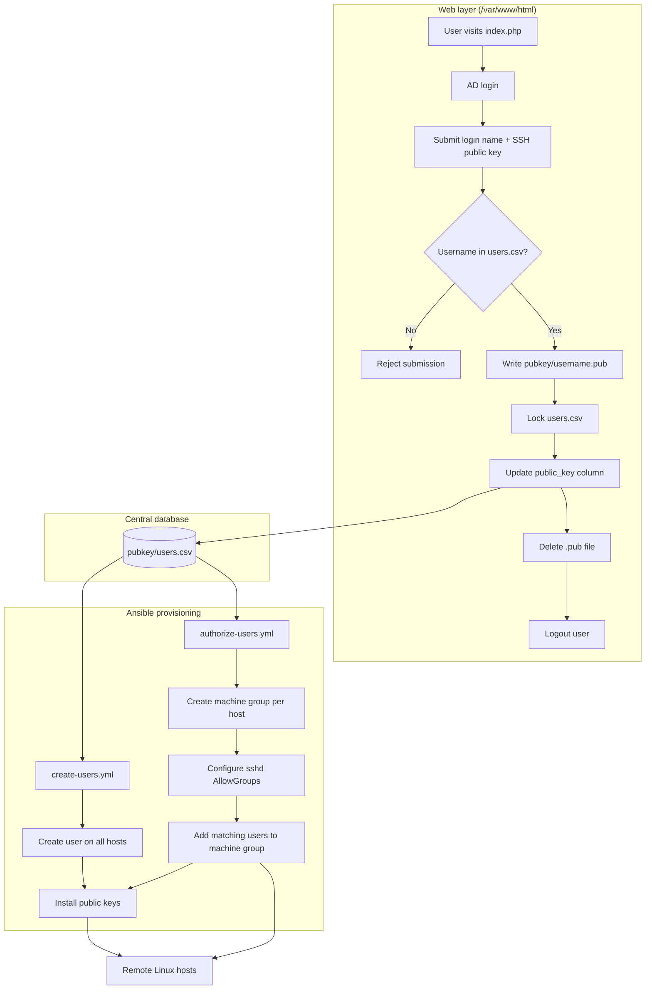
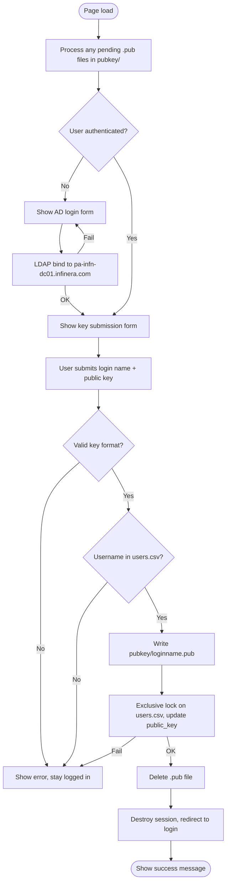
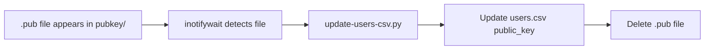
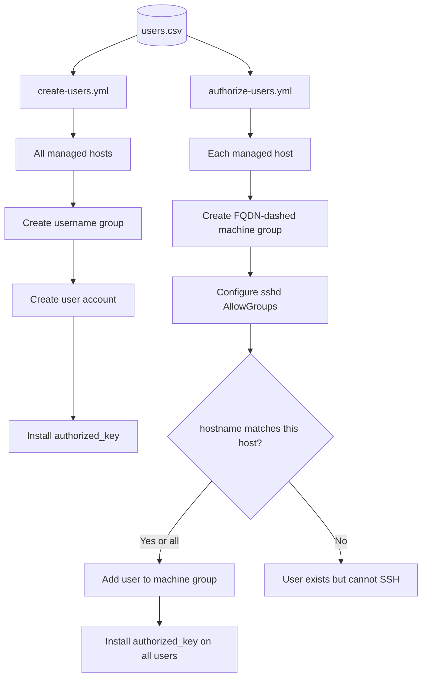

# SSH Key Registration and User Provisioning System

This document describes the web application, background services, and Ansible playbooks used to collect SSH public keys from users and provision Linux accounts across managed hosts.

## Overview

The system has three layers:

1. **Web collection** — Users authenticate with Active Directory and submit their SSH public key.
2. **Central user database** — `pubkey/users.csv` stores account definitions and public keys.
3. **Ansible provisioning** — Playbooks create accounts on remote hosts and control SSH access per machine.

Deployed web files live under `/var/www/html`. The Ansible repo lives at `/home/ansible/ansible`.

---

## Components

| File | Location (repo) | Deployed path | Purpose |
|------|-----------------|---------------|---------|
| `index.php` | `docroot/index.php` | `/var/www/html/index.php` | AD login, key submission, CSV updates |
| `pubkey/users.csv` | `docroot/pubkey/users.csv` | `/var/www/html/pubkey/users.csv` | Master user account database |
| `pubkey-sync.sh` | `docroot/pubkey-sync.sh` | `/var/www/html/pubkey-sync.sh` | Optional watcher for `.pub` drop files |
| `update-users-csv.py` | `docroot/update-users-csv.py` | `/var/www/html/update-users-csv.py` | Python helper used by `pubkey-sync.sh` |
| `pubkey-sync.service` | `docroot/pubkey-sync.service` | `/etc/systemd/system/pubkey-sync.service` | systemd unit for the watcher |
| `create-users.yml` | `playbooks/create-users.yml` | — | Create all users on all hosts |
| `authorize-users.yml` | `playbooks/authorize-users.yml` | — | Restrict SSH access by host |

---

## `users.csv` format

```csv
username,uid,gid,email,home_dir,public_key,hostname
sandholm,2000,2000,tom.sandholm@nokia.com,/share/home/sandholm,,sv-quantum-lx23.infinera.com
```

| Column | Description |
|--------|-------------|
| `username` | Linux login name |
| `uid` | Numeric user ID |
| `gid` | Numeric group ID |
| `email` | User email (stored in GECOS/comment) |
| `home_dir` | Home directory path |
| `public_key` | SSH public key (filled in via the web form) |
| `hostname` | Target host for SSH authorization (used by `authorize-users.yml`) |

Admins pre-populate rows before users can submit keys. The web form rejects usernames that are not already listed in `users.csv`.

For `authorize-users.yml`, `hostname` may be:

- A specific `inventory_hostname` or FQDN
- `all` (user authorized on every host)

---

## System flow



---

## Web form flow (`index.php`)



### Active Directory settings

Defined at the top of `index.php`:

| Setting | Value |
|---------|-------|
| AD server | `pa-infn-dc01.infinera.com` |
| Domain | `infinera.com` |
| NetBIOS | `INFINERA` |

Login formats accepted: `jdoe`, `jdoe@infinera.com`, `INFINERA\jdoe`.

### File locking

| Operation | Lock type |
|-----------|-----------|
| Check username exists | `LOCK_SH` (shared read) |
| Update public key | `LOCK_EX` (exclusive read/write) |

---

## Optional background service (`pubkey-sync`)

`pubkey-sync.sh` is an alternative path that watches `/var/www/html/pubkey` with `inotifywait`. When a `.pub` file appears, it calls `update-users-csv.py` to update `users.csv` and removes the drop file.

**Note:** `index.php` already updates `users.csv` directly on submit. If both are running, disable the systemd service to avoid duplicate processing:

```bash
sudo systemctl disable --now pubkey-sync
```



---

## Ansible provisioning flow

### `create-users.yml`

Runs on **all hosts**. For every row in `users.csv`:

1. Creates the user's primary group (`gid`)
2. Creates the user account (`uid`, `email`, `home_dir`)
3. Installs the SSH `public_key` into `~/.ssh/authorized_keys` (when set)

Does **not** use the `hostname` column.

```bash
ansible-playbook playbooks/create-users.yml
ansible-playbook playbooks/create-users.yml --limit sv-quantum-lx23
```

### `authorize-users.yml`

Controls **which users can SSH** to each host.

On each host:

1. Creates a **machine group** named from FQDN with dots replaced by dashes  
   Example: `sv-quantum-lx23.infinera.com` → `sv-quantum-lx23-infinera-com`
2. Writes `/etc/ssh/sshd_config.d/99-allowgroups.conf` with `AllowGroups`
3. Adds users to the machine group when their `hostname` column matches `all`, `inventory_hostname`, or FQDN
4. Installs SSH public keys for all users in `users.csv`

```bash
ansible-playbook playbooks/authorize-users.yml
ansible-playbook playbooks/authorize-users.yml --limit sv-quantum-lx23
```



---

## Typical operator workflow

1. **Admin** adds user rows to `docroot/pubkey/users.csv` (leave `public_key` empty).
2. **User** visits the web page, logs in with AD credentials, submits login name and SSH public key.
3. **Web app** validates the username, updates `public_key` in `users.csv`, logs the user out.
4. **Admin** runs Ansible:
   ```bash
   ansible-playbook playbooks/create-users.yml
   ansible-playbook playbooks/authorize-users.yml
   ```
5. User can SSH to assigned hosts using their submitted key.

---

## Supported SSH key types

- `ssh-rsa`
- `ssh-ed25519`
- `ecdsa-sha2-nistp256`

---

## Requirements

### Web server

- PHP with LDAP extension (`php-ldap`)
- Apache or nginx + php-fpm
- Write access to `/var/www/html/pubkey/` (including `users.csv`)

### Background service (optional)

- `inotify-tools`
- Python 3

### Ansible

- `community.general` collection (`read_csv`)
- `ansible.posix` collection (`authorized_key`)

---

## File map (repository)

```
ansible/
├── docroot/
│   ├── README.md              ← this document
│   ├── index.php              ← web UI
│   ├── pubkey-sync.sh         ← optional inotify watcher
│   ├── pubkey-sync.service    ← systemd unit
│   ├── update-users-csv.py    ← CSV updater for watcher
│   └── pubkey/
│       ├── users.csv          ← master user database
│       └── .gitignore         ← ignores *.pub drop files
└── playbooks/
    ├── create-users.yml       ← provision accounts on all hosts
    └── authorize-users.yml    ← SSH access control per host
```

## File map (deployed server)

```
/var/www/html/
├── index.php
├── pubkey-sync.sh
├── update-users-csv.py
└── pubkey/
    ├── users.csv
    └── (temporary .pub files during processing)

/home/ansible/ansible/
├── docroot/                   ← copy of web files
└── playbooks/
    ├── create-users.yml
    └── authorize-users.yml
```
